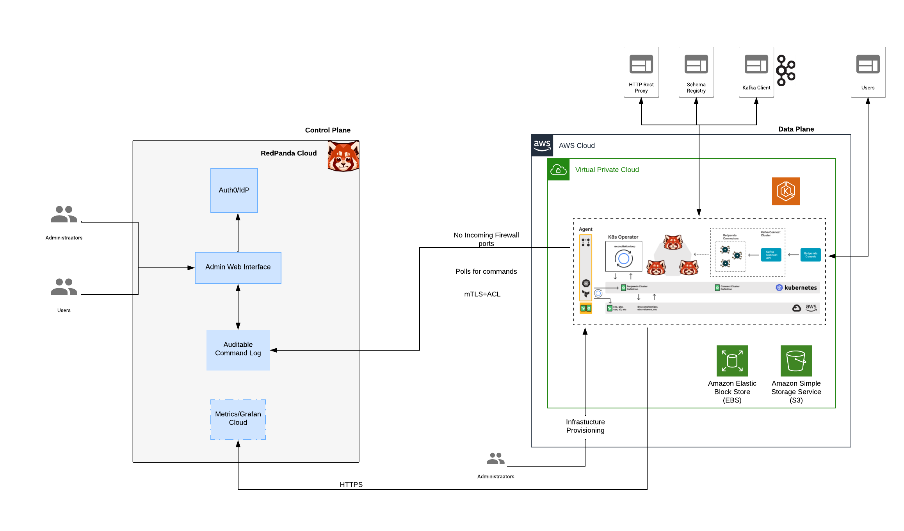

<head>
    <meta name="title" content="Redpanda Cloud Overview | Redpanda Docs"/>
    <meta name="description" content="Redpanda Cloud offers two ways to create a cluster: Dedicated Cloud and Bring Your Own Cloud (BYOC)."/>
</head>

Redpanda offers two ways to provision clusters in the cloud:
* Dedicated Cloud

    You host your data in Redpanda’s Virtual Private Cloud (VPC), and Redpanda handles provisioning, operations, and maintenance for you. Redpanda also performs automatic backups to S3 (for AWS) or GCS (for GCP).
* Bring Your Own Cloud (BYOC)

    You deploy Redpanda in your own VPC, so that all data is contained in your own environment. Redpanda handles provisioning, monitoring, and upgrades. Using your own VPC provides an additional layer of security and isolation. You can choose AWS or GCP as your cloud provider.

Both methods offer the following features:
* Single-zone or multi-zone availability
    * A single-zone cluster is deployed in one availability zone. If that availability zone fails, the cluster becomes unavailable.
    * A multi-zone cluster is deployed across three availability zones, which provides higher resiliency in the event of a failure in one of the zones.
* Private networking using VPC peering
* Ability to export metrics to a 3rd party monitoring system
* [Managed connectors](/docs/cloud/managed-connectors)
* Unlimited retention with tiered storage

The following architecture diagram illustrates the relationship between the Redpanda Cloud (the control plane) and a VPC in AWS.

## Dedicated Cloud

Dedicated clusters are single-tenant deployments launched from the Redpanda control plane. The Redpanda cluster is created in Redpanda’s VPC, and the endpoints are exposed so you can produce or consume events.

## BYOC

Setting up a BYOC cluster is initiated from the Redpanda Control Plane. This is a two-step process:
1. Bootstrap a VM in your VPC. This VM spins up the agent and the required infrastructure.
2. The agent communicates with the control plane to pull the control commands.

There is no outbound connection from your VPC to the Redpanda VPC in the control or data path.